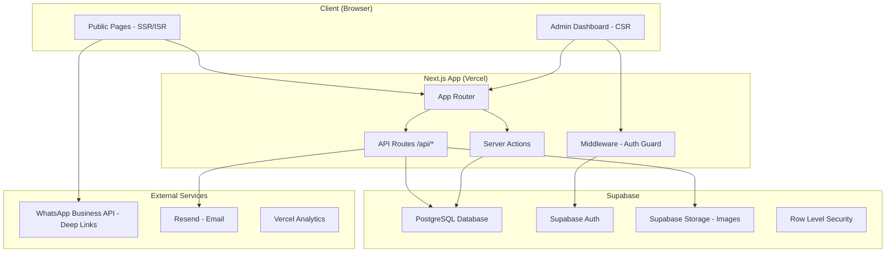
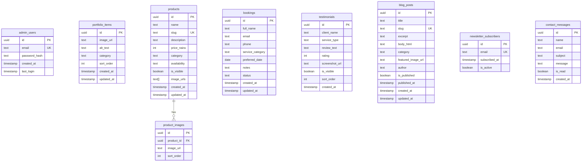

# Design Document: Hanney-V Website Redesign

## Overview

This design covers the complete redesign of the Hanney-V fashion brand website, transforming it from a Sanity Studio-backed site into a fully custom platform with a bespoke admin dashboard, WhatsApp-based e-commerce, booking system, portfolio gallery, blog, and newsletter — all wrapped in a luxury visual aesthetic.

**Key architectural decisions:**
- Replace Sanity CMS with Supabase (PostgreSQL) for data persistence and file storage
- Build a custom admin dashboard at `/admin` using Next.js App Router route groups
- Use WhatsApp deep links for order placement (no payment gateway needed)
- Server Components by default, Client Components only for interactive elements
- Incremental Static Regeneration (ISR) with on-demand revalidation for content freshness

**Technology stack:**
- **Framework**: Next.js 16 (App Router, Server Components, Server Actions)
- **Styling**: Tailwind CSS v4 with custom luxury design tokens
- **Animation**: Framer Motion 12
- **Database**: Supabase (PostgreSQL + Auth + Storage)
- **Deployment**: Vercel with GitHub integration
- **Rich Text**: Tiptap editor (admin) / rendered HTML (public)
- **Email**: Resend (transactional emails for booking confirmations)

## Architecture

### High-Level Architecture



### Routing Architecture

```
src/app/
├── (public)/                    # Public route group
│   ├── page.tsx                 # Homepage
│   ├── about/page.tsx           # About page
│   ├── services/page.tsx        # Services page
│   ├── portfolio/page.tsx       # Portfolio gallery
│   ├── booking/page.tsx         # Booking form
│   ├── contact/page.tsx         # Contact page
│   ├── blog/
│   │   ├── page.tsx             # Blog listing
│   │   └── [slug]/page.tsx      # Blog post detail
│   └── products/
│       ├── page.tsx             # Product catalog
│       └── [id]/page.tsx        # Product detail
├── (admin)/
│   └── admin/
│       ├── layout.tsx           # Admin layout with sidebar
│       ├── page.tsx             # Dashboard overview
│       ├── login/page.tsx       # Login page
│       ├── portfolio/page.tsx   # Manage portfolio
│       ├── products/page.tsx    # Manage products
│       ├── bookings/page.tsx    # Manage bookings
│       ├── testimonials/page.tsx # Manage testimonials
│       ├── blog/
│       │   ├── page.tsx         # Blog list
│       │   └── [id]/edit/page.tsx # Blog editor
│       ├── subscribers/page.tsx # Newsletter subscribers
│       └── settings/page.tsx    # Admin settings
├── api/
│   ├── bookings/route.ts       # Booking CRUD
│   ├── contact/route.ts        # Contact form submission
│   ├── newsletter/route.ts     # Newsletter subscription
│   ├── portfolio/route.ts      # Portfolio CRUD
│   ├── products/route.ts       # Product CRUD
│   ├── testimonials/route.ts   # Testimonials CRUD
│   ├── blog/route.ts           # Blog CRUD
│   ├── upload/route.ts         # Image upload
│   └── revalidate/route.ts     # On-demand ISR revalidation
├── layout.tsx                   # Root layout
├── globals.css                  # Global styles
└── sitemap.ts                   # Dynamic sitemap generation
```

### Data Flow Patterns

**Public pages (read path):**
1. Server Component fetches data from Supabase at build/request time
2. ISR caches pages with `revalidate: 60` (60-second staleness window)
3. Admin content changes trigger on-demand revalidation via `/api/revalidate`

**Admin operations (write path):**
1. Client Component submits form data via Server Action or API route
2. Server validates input, writes to Supabase
3. On success, calls `revalidatePath()` or `revalidateTag()` to refresh public pages
4. Returns success/error response to client

**Authentication flow:**
1. Middleware checks `/admin/*` routes (except `/admin/login`)
2. Validates Supabase session token from cookies
3. Redirects unauthenticated users to `/admin/login`
4. Admin login uses Supabase Auth with email/password

## Components and Interfaces

### Design System Components

```
src/components/
├── ui/                          # Primitive UI components
│   ├── Button.tsx               # Primary, secondary, ghost variants
│   ├── Input.tsx                # Form input with validation states
│   ├── Textarea.tsx             # Multi-line input
│   ├── Select.tsx               # Dropdown select
│   ├── Badge.tsx                # Status badges
│   ├── Card.tsx                 # Content card container
│   ├── Modal.tsx                # Dialog/modal overlay
│   ├── Toast.tsx                # Notification toasts
│   ├── Skeleton.tsx             # Loading skeleton
│   └── SectionHeading.tsx       # Section title with decorative elements
├── layout/
│   ├── Navbar.tsx               # Public navigation bar
│   ├── Footer.tsx               # Site footer with social links
│   ├── AdminSidebar.tsx         # Admin navigation sidebar
│   └── AdminHeader.tsx          # Admin top bar
├── sections/                    # Homepage & page sections
│   ├── HeroSection.tsx          # Full-viewport hero
│   ├── ServicesPreview.tsx      # Services grid
│   ├── PortfolioPreview.tsx     # Portfolio image grid
│   ├── TestimonialsCarousel.tsx # Auto-scrolling testimonials
│   ├── NewsletterSection.tsx    # Email subscription form
│   └── CTASection.tsx           # Call-to-action banner
├── shared/
│   ├── WhatsAppButton.tsx       # Floating WhatsApp FAB
│   ├── Lightbox.tsx             # Image lightbox overlay
│   ├── CategoryFilter.tsx       # Reusable category filter buttons
│   ├── Pagination.tsx           # Page navigation
│   ├── ImageUploader.tsx        # Admin image upload widget
│   ├── RichTextEditor.tsx       # Tiptap-based editor (admin)
│   ├── RichTextRenderer.tsx     # HTML content renderer (public)
│   ├── StarRating.tsx           # Star rating display
│   └── AnimatedSection.tsx      # Framer Motion scroll reveal wrapper
└── forms/
    ├── BookingForm.tsx          # Booking appointment form
    ├── ContactForm.tsx          # Contact page form
    └── NewsletterForm.tsx       # Newsletter subscription form
```

### Key Component Interfaces

```typescript
// AnimatedSection - wraps content with scroll-triggered animations
interface AnimatedSectionProps {
  children: React.ReactNode;
  delay?: number;          // stagger delay in ms (100-200)
  duration?: number;       // animation duration (300-800ms)
  direction?: 'up' | 'down' | 'left' | 'right';
}

// CategoryFilter - reusable filter buttons
interface CategoryFilterProps {
  categories: string[];
  activeCategory: string;
  onCategoryChange: (category: string) => void;
  allLabel?: string;       // defaults to "All"
}

// Lightbox - image gallery overlay
interface LightboxProps {
  images: { src: string; alt: string }[];
  initialIndex: number;
  isOpen: boolean;
  onClose: () => void;
}

// ImageUploader - admin image upload
interface ImageUploaderProps {
  bucket: string;          // Supabase storage bucket name
  maxSize?: number;        // max file size in bytes (default 10MB)
  acceptedFormats?: string[]; // ['image/jpeg', 'image/png', 'image/webp']
  onUpload: (url: string) => void;
  onError: (message: string) => void;
}

// RichTextEditor - Tiptap editor for admin
interface RichTextEditorProps {
  content: string;         // HTML content
  onChange: (html: string) => void;
  placeholder?: string;
}
```

### API Route Interfaces

```typescript
// POST /api/bookings
interface CreateBookingRequest {
  fullName: string;        // max 100 chars
  email: string;
  phone: string;           // max 20 chars, digits + spaces allowed
  serviceCategory: 'bespoke' | 'bridal' | 'event';
  preferredDate: string;   // ISO date, today to +90 days
  notes?: string;          // max 500 chars
}

// POST /api/contact
interface CreateContactRequest {
  name: string;            // max 100 chars
  email: string;
  subject: string;         // max 150 chars
  message: string;         // max 2000 chars
}

// POST /api/newsletter
interface SubscribeRequest {
  email: string;           // max 254 chars
}

// POST /api/upload
// multipart/form-data with file field
// Returns: { url: string }

// POST /api/revalidate
interface RevalidateRequest {
  paths: string[];         // paths to revalidate
  secret: string;          // revalidation secret
}
```

## Data Models

### Database Schema (Supabase PostgreSQL)



### TypeScript Types

```typescript
// Database row types (matching Supabase schema)
export interface PortfolioItem {
  id: string;
  image_url: string;
  alt_text: string;
  category: 'Bespoke' | 'Bridal' | 'Traditional' | 'Event';
  sort_order: number;
  created_at: string;
  updated_at: string;
}

export interface Product {
  id: string;
  name: string;
  slug: string;
  description: string;
  price_naira: number;
  category: string;
  availability: 'available' | 'made-to-order' | 'sold-out';
  is_visible: boolean;
  image_urls: string[];
  created_at: string;
  updated_at: string;
}

export interface Booking {
  id: string;
  full_name: string;
  email: string;
  phone: string;
  service_category: 'bespoke' | 'bridal' | 'event';
  preferred_date: string;
  notes: string | null;
  status: 'pending' | 'confirmed' | 'completed' | 'cancelled';
  created_at: string;
  updated_at: string;
}

export interface Testimonial {
  id: string;
  client_name: string;
  service_type: string;
  review_text: string;
  rating: 1 | 2 | 3 | 4 | 5;
  screenshot_url: string | null;
  is_visible: boolean;
  sort_order: number;
  created_at: string;
}

export interface BlogPost {
  id: string;
  title: string;
  slug: string;
  excerpt: string | null;
  body_html: string;
  category: string;
  featured_image_url: string;
  author: string;
  is_published: boolean;
  published_at: string | null;
  created_at: string;
  updated_at: string;
}

export interface NewsletterSubscriber {
  id: string;
  email: string;
  subscribed_at: string;
  is_active: boolean;
}

export interface ContactMessage {
  id: string;
  name: string;
  email: string;
  subject: string;
  message: string;
  is_read: boolean;
  created_at: string;
}
```

### Validation Schemas (Zod)

```typescript
import { z } from 'zod';

export const bookingSchema = z.object({
  fullName: z.string().min(1).max(100),
  email: z.string().email().max(254),
  phone: z.string().min(1).max(20).regex(/^[\d\s+]+$/),
  serviceCategory: z.enum(['bespoke', 'bridal', 'event']),
  preferredDate: z.string().refine((date) => {
    const d = new Date(date);
    const today = new Date();
    today.setHours(0, 0, 0, 0);
    const maxDate = new Date(today);
    maxDate.setDate(maxDate.getDate() + 90);
    return d >= today && d <= maxDate;
  }, 'Date must be between today and 90 days from now'),
  notes: z.string().max(500).optional(),
});

export const contactSchema = z.object({
  name: z.string().min(1).max(100),
  email: z.string().email().max(254),
  subject: z.string().min(1).max(150),
  message: z.string().min(1).max(2000),
});

export const newsletterSchema = z.object({
  email: z.string().email().max(254),
});

export const productSchema = z.object({
  name: z.string().min(1).max(150),
  description: z.string().min(1).max(2000),
  price_naira: z.number().positive(),
  category: z.string().min(1),
  availability: z.enum(['available', 'made-to-order', 'sold-out']),
  image_urls: z.array(z.string().url()).min(1).max(10),
  is_visible: z.boolean(),
});

export const blogPostSchema = z.object({
  title: z.string().min(1).max(200),
  excerpt: z.string().max(200).optional(),
  body_html: z.string().min(1),
  category: z.string().min(1),
  featured_image_url: z.string().url(),
  author: z.string().min(1),
  is_published: z.boolean(),
  published_at: z.string().optional(),
});

export const testimonialSchema = z.object({
  client_name: z.string().min(1).max(100),
  service_type: z.string().min(1),
  review_text: z.string().min(1).max(500),
  rating: z.number().int().min(1).max(5),
  screenshot_url: z.string().url().optional(),
  is_visible: z.boolean(),
});
```

## Correctness Properties

*A property is a characteristic or behavior that should hold true across all valid executions of a system — essentially, a formal statement about what the system should do. Properties serve as the bridge between human-readable specifications and machine-verifiable correctness guarantees.*

### Property 1: Booking form validation accepts valid inputs and rejects invalid ones

*For any* input object to the booking validation schema, the validator SHALL accept the input if and only if: fullName is 1-100 characters, email is valid format and max 254 characters, phone is 1-20 characters containing only digits/spaces/plus, serviceCategory is one of 'bespoke'/'bridal'/'event', preferredDate is between today and today+90 days inclusive, and notes (if present) is max 500 characters. Invalid inputs SHALL produce per-field error messages identifying each failing constraint.

**Validates: Requirements 6.1, 6.2, 6.5**

### Property 2: Contact form validation accepts valid inputs and rejects invalid ones

*For any* input object to the contact validation schema, the validator SHALL accept the input if and only if: name is 1-100 characters, email is valid format and max 254 characters, subject is 1-150 characters, and message is 1-2000 characters. Invalid inputs SHALL produce per-field error messages.

**Validates: Requirements 7.2, 7.7**

### Property 3: Category filtering returns only matching items

*For any* list of items (portfolio images, blog posts, or products) each having a `category` field, and *for any* selected category string, the filter function SHALL return only items whose category matches the selection. When the selection is "All", the filter SHALL return all items unchanged.

**Validates: Requirements 5.4, 9.5, 13.2**

### Property 4: WhatsApp URL generation produces valid deep links

*For any* message text and the business phone number 2348105177258, the WhatsApp URL generator SHALL produce a URL of the form `https://wa.me/2348105177258?text={encoded_message}` where the message is properly URL-encoded and the resulting URL is parseable as a valid URL.

**Validates: Requirements 7.3, 13.4**

### Property 5: Blog pagination returns correct page slices

*For any* list of N published blog posts and *for any* page number P (where P >= 1), the pagination function SHALL return at most 9 posts for that page, ordered by publication date descending, where page 1 contains the 9 most recent posts, page 2 contains posts 10-18, and so on. The total page count SHALL equal ceil(N / 9).

**Validates: Requirements 9.1**

### Property 6: Newsletter subscription deduplication

*For any* valid email address, subscribing the same email K times (K >= 1) SHALL result in exactly one active subscriber record in the database for that email. Subsequent subscription attempts for an already-subscribed email SHALL not create duplicate entries.

**Validates: Requirements 10.3**

### Property 7: File upload validation enforces format and size constraints

*For any* file with a given MIME type and byte size, the upload validator SHALL accept the file if and only if: the MIME type is one of 'image/jpeg', 'image/png', or 'image/webp', AND the file size is less than or equal to 10,485,760 bytes (10MB). Files failing either constraint SHALL be rejected with an error message identifying the specific violation.

**Validates: Requirements 12.3, 12.13**

### Property 8: Price formatting produces correct Naira representation

*For any* positive integer representing a price in Naira, the price formatter SHALL produce a string starting with "₦" followed by the number formatted with thousands separators (commas). The formatted string SHALL be parseable back to the original integer value when the "₦" prefix and commas are removed.

**Validates: Requirements 13.1**

### Property 9: CSV export contains all subscriber emails

*For any* list of newsletter subscriber records, the CSV export function SHALL produce a valid CSV string where: the first row is a header row, each subsequent row contains a subscriber's email, and the total number of data rows equals the number of subscribers in the input list.

**Validates: Requirements 12.8**

### Property 10: Portfolio preview selection respects count bounds

*For any* list of portfolio items with length N >= 4, the preview selection function SHALL return between 4 and 8 items (inclusive), ordered by creation date descending. If N < 4, the function SHALL return an empty result (indicating the section should be hidden).

**Validates: Requirements 2.3, 2.7**

### Property 11: JSON-LD generation produces valid structured data

*For any* product data object with name, price, description, image URL, and availability, the JSON-LD generator SHALL produce a valid JSON object with `@context` set to "https://schema.org", `@type` set to "Product", and all required schema.org Product fields populated from the input data.

**Validates: Requirements 14.2**

### Property 12: Page metadata respects length constraints

*For any* page metadata configuration (title source text and description source text), the metadata generator SHALL produce a meta title of at most 60 characters and a meta description of at most 160 characters, truncating with ellipsis if the source text exceeds the limit.

**Validates: Requirements 14.1**

### Property 13: Color contrast ratio meets WCAG AA

*For any* pair of foreground and background colors from the design token palette, the computed contrast ratio SHALL be at least 4.5:1 for body text pairings and at least 3:1 for large text and UI component pairings.

**Validates: Requirements 1.1**

## Error Handling

### Client-Side Error Handling

| Scenario | Behavior |
|----------|----------|
| Form validation failure | Highlight invalid fields with red border, show per-field error message below each field, prevent submission |
| Network request failure | Show toast notification with "Something went wrong. Please try again." message, preserve form data |
| Image load failure | Display branded placeholder image (gold gradient with Hanney-V logo) |
| 404 page | Custom branded 404 page with navigation back to homepage |
| Empty data states | Show contextual empty state message (e.g., "No products in this category") |

### Server-Side Error Handling

| Scenario | Behavior |
|----------|----------|
| Database unreachable | Return 503 with user-friendly error page, log error details server-side |
| Invalid request body | Return 400 with Zod validation error details (field-level) |
| Unauthorized access | Return 401, redirect to login page |
| File upload too large | Return 413 with size limit message |
| File wrong format | Return 415 with accepted formats message |
| Rate limiting | Return 429 with retry-after header |
| Unexpected server error | Return 500 with generic message, log full error with stack trace |

### Error Boundary Strategy

```typescript
// Global error boundary in app/error.tsx
// Per-route error boundaries in each route segment
// Graceful degradation: if a section fails to load, hide it rather than crash the page
```

### Revalidation Error Handling

- If on-demand revalidation fails, the stale cached page continues to serve (ISR fallback)
- Admin dashboard shows a warning if revalidation request fails
- Automatic retry with exponential backoff (1s, 2s, 4s) for failed revalidation calls

## Testing Strategy

### Testing Stack

- **Unit Tests**: Vitest (fast, ESM-native, compatible with Next.js)
- **Property-Based Tests**: fast-check (with Vitest)
- **Component Tests**: React Testing Library + Vitest
- **Integration Tests**: Playwright (E2E browser tests)
- **Visual Regression**: Playwright screenshots across breakpoints

### Property-Based Testing Configuration

Each property test runs a minimum of 100 iterations using fast-check. Tests are tagged with their corresponding design property:

```typescript
// Example tag format
// Feature: hanney-v-redesign, Property 1: Booking form validation accepts valid inputs and rejects invalid ones
```

**Library**: `fast-check` (npm package)
**Runner**: Vitest with `@fast-check/vitest` integration
**Iterations**: Minimum 100 per property (configurable via `numRuns`)

### Test Organization

```
tests/
├── unit/                        # Pure function unit tests
│   ├── validation.test.ts       # Zod schema tests
│   ├── formatting.test.ts       # Price formatter, URL generators
│   ├── filtering.test.ts        # Category filter logic
│   ├── pagination.test.ts       # Blog pagination
│   └── csv-export.test.ts       # CSV generation
├── properties/                  # Property-based tests
│   ├── booking-validation.prop.ts
│   ├── contact-validation.prop.ts
│   ├── category-filter.prop.ts
│   ├── whatsapp-url.prop.ts
│   ├── pagination.prop.ts
│   ├── file-upload.prop.ts
│   ├── price-format.prop.ts
│   ├── csv-export.prop.ts
│   ├── portfolio-preview.prop.ts
│   ├── jsonld.prop.ts
│   ├── metadata.prop.ts
│   └── contrast-ratio.prop.ts
├── components/                  # React component tests
│   ├── HeroSection.test.tsx
│   ├── CategoryFilter.test.tsx
│   ├── TestimonialsCarousel.test.tsx
│   └── ...
├── integration/                 # API route integration tests
│   ├── bookings.test.ts
│   ├── newsletter.test.ts
│   └── ...
└── e2e/                         # Playwright E2E tests
    ├── homepage.spec.ts
    ├── booking-flow.spec.ts
    ├── admin-login.spec.ts
    └── ...
```

### Unit Test Coverage Targets

- Validation schemas: 100% branch coverage
- Utility functions (formatting, filtering, URL generation): 100%
- React components: Key interaction paths and conditional rendering
- API routes: Happy path + error cases

### Integration Test Scope

- Full booking submission flow (form → API → database → confirmation)
- Admin CRUD operations (create → read → update → delete)
- Authentication flow (login → session → protected routes → logout)
- Newsletter subscription (subscribe → duplicate check → success/error)
- Image upload (select → validate → upload → URL return)

### Performance Testing

- Lighthouse CI in GitHub Actions (fail build if score < 80 mobile, < 90 desktop)
- Core Web Vitals monitoring via Vercel Analytics
- Image optimization verification (proper srcSet, lazy loading)

